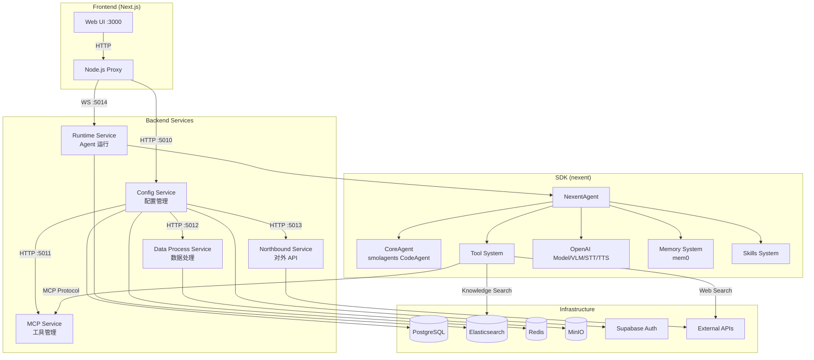

# 代码架构：Nexent

## 整体架构概述

Nexent 采用**微��务架构**，后端拆分为多个独立的 FastAPI 服务进程（Config、Runtime、MCP、Northbound、Data Process），通过 Docker Compose 编排部署。前端为独立的 Next.js 应用，通过 HTTP/WebSocket 与后端通信。SDK 层（`sdk/nexent`）作为纯 Python 库，封装了 Agent 核心、模型、工具、记忆、向量检索等能力，被后端服务引用。

整体属于**分层 + 插件化**架构：
- **表现层**（Frontend）→ **API 层**（Backend Apps）→ **服务层**（Backend Services）→ **SDK 层**→ **基础设施层**（DB/ES/MinIO/Redis）

## 架构图



## 模块划分

### 后端模块

| 模块 | 路径 | 职责 | 对外接口 | 依赖模块 |
|------|------|------|----------|----------|
| **Config Service** | `backend/config_service.py` | 主配置 API 服务，管理 Agent/模型/工具/知识库等配置 | HTTP `:5010/api/*` | Services, Database, SDK |
| **Runtime Service** | `backend/runtime_service.py` | Agent 运行时服务，处理对话流和 Agent 执行 | HTTP+WS `:5014/api/*` | Agents, SDK |
| **MCP Service** | `backend/mcp_service.py` | MCP 工具协议服务，管理 MCP 容器和工具注册 | HTTP `:5011/*` | MCP SDK |
| **Northbound Service** | `backend/northbound_service.py` | 对北向开放 API，供外部平台调用 | HTTP `:5013/api/*` | Services |
| **Data Process Service** | `backend/data_process_service.py` | 数据处理服务，文件解析、向量化、OCR | HTTP `:5012/api/*` | Ray, Celery |
| **Apps 层** | `backend/apps/` | HTTP 端点定义，参数校验，调用 Services | FastAPI Router | Services |
| **Services 层** | `backend/services/` | 核心业务逻辑编排 | Python 函数 | SDK, Database |
| **Agents** | `backend/agents/` | Agent 运行管理、Agent 信息构建 | Python 类 | SDK, Services |
| **Database** | `backend/database/` | 数据访问层（SQLAlchemy ORM） | Python 函数 | PostgreSQL |
| **Consts** | `backend/consts/` | 环境变量、异常、数据模型定义 | — | — |
| **Utils** | `backend/utils/` | 认证、LLM、日志等工具函数 | — | — |

### SDK 模块

| 模块 | 路径 | 职责 |
|------|------|------|
| **core** | `sdk/nexent/core/` | Agent 核心（NexentAgent, CoreAgent）、模型（OpenAI, Embedding）、工具集 |
| **memory** | `sdk/nexent/memory/` | 记忆系统，基于 mem0 的多级记忆管理 |
| **vector_database** | `sdk/nexent/vector_database/` | 向量数据库抽象层（Elasticsearch 实现） |
| **storage** | `sdk/nexent/storage/` | 对象存储客户端（MinIO 实现） |
| **skills** | `sdk/nexent/skills/` | 技能系统，加载和管理 SKILL.md 定义的可扩展技能 |
| **data_process** | `sdk/nexent/data_process/` | 数据处理工具（文件解析、分块） |
| **container** | `sdk/nexent/container/` | 容器管理（MCP 容器编排） |
| **monitor** | `sdk/nexent/monitor/` | 监控追踪（OpenTelemetry） |
| **multi_modal** | `sdk/nexent/multi_modal/` | 多模态支持（语音识别/合成） |
| **datamate** | `sdk/nexent/datamate/` | DataMate 数据搜索集成 |
| **utils** | `sdk/nexent/utils/` | SDK 级通用工具 |

### 前端模块

| 模块 | 路径 | 职责 |
|------|------|------|
| **app/** | `frontend/app/` | Next.js 页面路由（国际化 `[locale]/`） |
| **components/** | `frontend/components/` | React 组件（Agent、Chat、MCP、Auth、Tool 等） |
| **services/** | `frontend/services/` | API 客户端服务（与后端通信） |
| **stores/** | `frontend/stores/` | Zustand 状态管理 |
| **hooks/** | `frontend/hooks/` | 自定义 React Hooks |
| **types/** | `frontend/types/` | TypeScript 类型定义 |

## 核心抽象与设计模式

### 核心类

| 类名 | 位置 | 职责 |
|------|------|------|
| `CoreAgent` | `sdk/nexent/core/agents/core_agent.py` | 继承 smolagents `CodeAgent`，Agent 执行引擎，支持流式输出和观察者模式 |
| `NexentAgent` | `sdk/nexent/core/agents/nexent_agent.py` | Agent 工厂，负责创建模型、工具、Agent 实例 |
| `AgentRunManager` | `backend/agents/agent_run_manager.py` | 单例模式，管理所有活跃的 Agent 运行实例 |
| `MessageObserver` | `sdk/nexent/core/utils/observer.py` | 观察者模式，收集 Agent 执行过程中的消息并缓存供流式推送 |
| `VectorDatabaseCore` | `sdk/nexent/vector_database/base.py` | 向量数据库抽象基类，定义索引管理、搜索、文档操作接口 |
| `StorageClient` | `sdk/nexent/storage/storage_client_base.py` | 存储客户端抽象基类 |
| `SkillManager` | `sdk/nexent/skills/skill_manager.py` | 技能管理器，加载/保存/执行技能 |
| `AppException` | `backend/consts/exceptions.py` | 统一应用异常，携带 ErrorCode 和 HTTP 状态映射 |

### 设计模式

| 模式 | 应用位置 | 说明 |
|------|----------|------|
| **工厂模式** | `NexentAgent.create_tool()` | 根据工具来源（local/mcp/langchain/builtin）创建不同类型的工具实例 |
| **单例模式** | `AgentRunManager` | 全局唯一的 Agent 运行管理器 |
| **观察者模式** | `MessageObserver` | Agent 执行过程中通过 Observer 推送消息，Runtime 层轮询 Observer 缓存实现流式输出 |
| **策略模式** | `VectorDatabaseCore` → `ElasticsearchCore` | 向量数据库操作可替换实现 |
| **工厂模式** | `create_storage_client_from_config()` | 根据配置创建不同类型的存储客户端 |
| **模板方法** | `CoreAgent._step_stream()` / `run()` | 定义 Agent 执行骨架，子类可覆写特定步骤 |
| **分层异常** | `AppException` + Legacy Exceptions | 新旧两套异常体系共存，统一通过 `app_factory` 中的异常处理器映射 |

## 外部集成

| 外部服务 | 用途 | 对接模块 | 协议/方式 |
|----------|------|----------|-----------|
| **PostgreSQL** | 业务数据存储（用户、租户、Agent、工具等） | `backend/database/` | SQLAlchemy ORM |
| **Elasticsearch** | 向量检索 + 全文搜索（知识库） | `sdk/nexent/vector_database/elasticsearch_core.py` | REST API |
| **Redis** | 任务队列（Celery）+ 缓存 | `backend/services/redis_service.py` | Redis 协议 |
| **MinIO** | 文件对象存储 | `sdk/nexent/storage/minio.py` | S3 兼容 API |
| **Supabase Auth** | 用户认证 | `backend/utils/auth_utils.py` | REST API + JWT |
| **OpenAI 兼容 API** | LLM 推理 | `sdk/nexent/core/models/openai_llm.py` | OpenAI SDK |
| **MCP Server** | 外部工具调用 | `sdk/nexent/core/agents/run_agent.py` | MCP Protocol (SSE/StreamableHTTP) |
| **外部搜索** | 互联网搜索（Tavily/Exa/LinkUp） | `sdk/nexent/core/tools/` | 各自 SDK |

## 扩展点

### 1. MCP 工具生态
- 通过 MCP（Model Context Protocol）协议接入外部工具
- 支持容器化部署 MCP Server（Docker/K8s）
- 对接方式：`sdk/nexent/core/agents/run_agent.py` 中 `ToolCollection.from_mcp()`

### 2. LangChain 工具
- 在 `backend/tool_collection/langchain/` 目录下放置 LangChain 工具文件
- 自动发现并注册为可用工具

### 3. 技能（Skills）系统
- 通过 SKILL.md 定义技能，放在 `SKILLS_PATH` 目录下
- 支持脚本执行（Python/Shell），通过 `RunSkillScriptTool` 调用

### 4. 向量数据库
- 实现 `VectorDatabaseCore` 抽象基类即可支持新的向量数据库
- 当前实现：Elasticsearch

### 5. 存储后端
- 实现 `StorageClient` 抽象基类即可支持新的存储后端
- 当前实现：MinIO

## 模块依赖方向

```
Frontend → Backend Apps → Backend Services → SDK → External Services
                                ↓
                           Backend Database
                                ↓
                           PostgreSQL / Redis / ES / MinIO
```

- **单向依赖**：上层依赖下层，无循环依赖
- **SDK 无后端依赖**：SDK 是纯 Python 库，不依赖后端任何模块
- **Apps 层不直接访问数据库**：通过 Services 层间接访问
- **Services 层不处理 HTTP**：只抛出领域异常，由 Apps 层转换为 HTTP 响应
